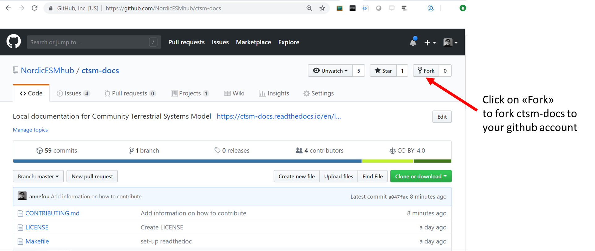
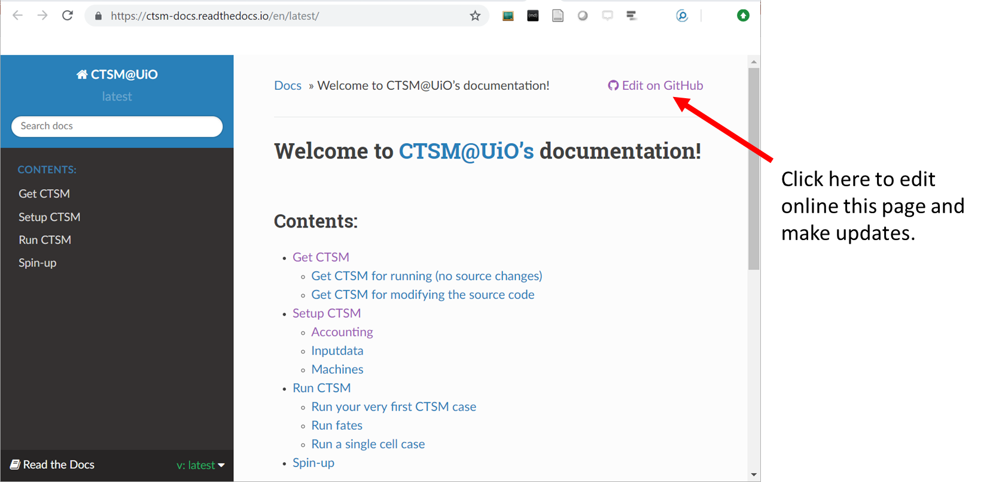
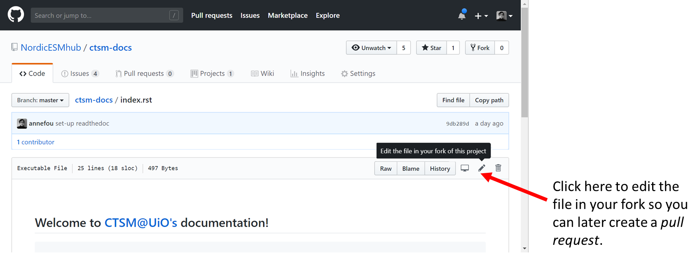
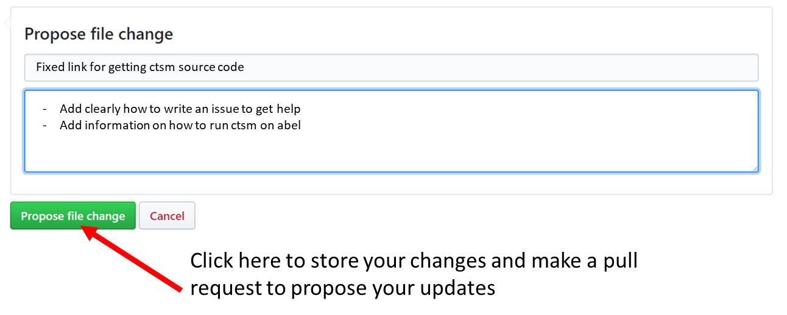

## How to contribute to the CTSM@UiO documentation

- step 1: Fork this repository as shown in the figure below.

- step 2: Go online to [CTSM documentation](https://ctsm-docs.readthedocs.io/en/latest/) and whenever you would like to update the documentation, click on "Edit on GitHub".

- step 3: Then click on the "pen" (see image below) and write your text ([reStructuredText](http://docutils.sourceforge.net/docs/user/rst/quickref.html)) 

- step 4: Save your changes in your forked repository and create a pull request.

If you do not like to update the documentation online and prefer to use your favorite editor locally on your machine/laptop, you can skip step-3 and 4 and then clone your forked repository to edit the files locally. Once pushed to your forked github repository, you can create a pull request and propose your changes.
